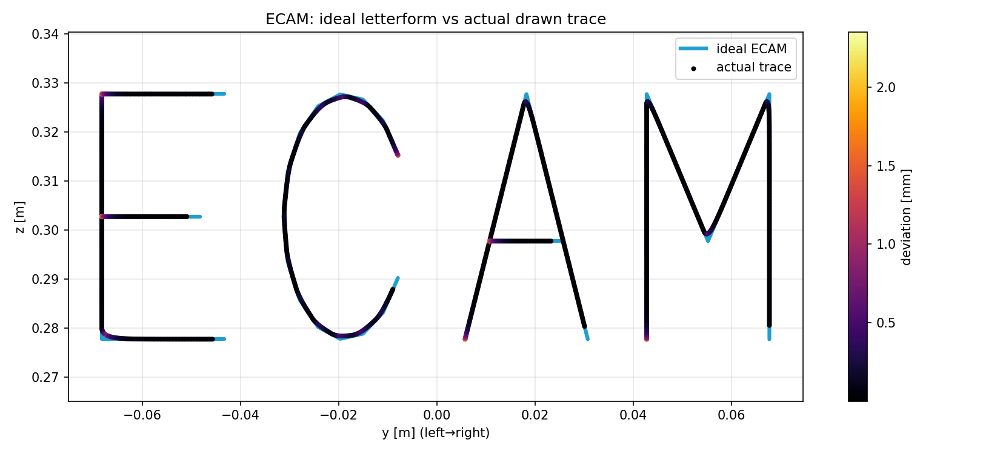
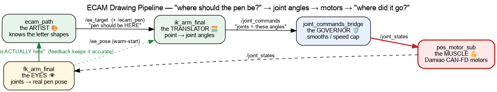

# arm7_draw_ecam — a 7-DOF arm writes "ECAM" in Gazebo

A ROS 2 demo in which a 7-DOF redundant arm draws the word **ECAM** (or a circle,
square, helix, or the ECAM-LaSalle badge) with a pen tip. The whole motion is planned
**offline** — every waypoint solved by a Damped-Least-Squares inverse-kinematics solver —
and executed as a **single multi-point `FollowJointTrajectory` goal** by a velocity
`JointTrajectoryController` in Ignition Gazebo.

This is the drawing demo extracted from my 7-DOF arm thesis workspace, trimmed to one
focused, reproducible pipeline. The kinematics core lives in a companion repo,
[`arm7-dls-ik`](https://github.com/piranut-op/arm7-dls-ik).



## What it is / why it's interesting

Most pick-and-place demos hide the hard part — turning a Cartesian *path* into joint
motion a controller can execute. This demo makes that the whole point, on a **redundant**
(7-DOF) arm where IK has infinitely many solutions:

- **Everything is solved offline, once.** `ecam_traj.py` builds the letter path, solves
  each waypoint with the thesis DLS IK (warm-started from the previous solution — no
  branch hopping), and stitches a prepose → draw → return-home trajectory. It sends **one**
  `FollowJointTrajectory` action goal. No streaming, no real-time IK, no posture gate —
  the controller's native multi-point input does the rest. Delivery is acknowledged and the
  result reported, so there's no discovery race and no node left publishing afterwards.
- **Deterministic and measurable.** Because the joint stream is a pure function of the
  letter geometry, the run is repeatable. A rosbag of `/ee_target`, `/ee_pose`, `/ecam_pen`
  is recorded for accuracy analysis.
- **Two writing planes.** `plane:=vertical` writes on a wall in front of the base;
  `plane:=ground` rotates the same geometry flat onto the table and swaps in a verified
  pen-down posture.

## Results

Authoritative Gazebo run (full orientation + writing posture, committed under
`results/ecam_drawing/`), over **1641 pen-down samples**:

| Letterform deviation (actual trace vs. ideal letters) | value |
|---|---|
| median | **0.017 mm** |
| mean / RMS | 0.125 mm / 0.322 mm |
| p95 | 0.572 mm |
| max | 2.351 mm |

Regenerate the figures and this table offline (no ROS needed):

```bash
python3 tools/plot_ecam_thesis.py        # reads results/ecam_drawing/*.csv -> figures + table
```

## Quick start

Requires **ROS 2 Humble**, **Ignition Gazebo** + `ros_gz`, and `ign_ros2_control`
(plus `controller_manager`, `joint_trajectory_controller`, `joint_state_broadcaster`).

```bash
# clone into a colcon workspace's src/
cd ~/ros2_ws/src && git clone https://github.com/piranut-op/arm7_draw_ecam.git
cd ~/ros2_ws && colcon build --packages-select arm7_draw_ecam && source install/setup.bash

# draw "ECAM" in Gazebo (RViz also opens by default)
ros2 launch arm7_draw_ecam ecam_simple.launch.py
```

Useful arguments:

```bash
ros2 launch arm7_draw_ecam ecam_simple.launch.py plane:=ground        # pen DOWN, flat on the table
ros2 launch arm7_draw_ecam ecam_simple.launch.py shape:=logo          # the ECAM-LaSalle badge
ros2 launch arm7_draw_ecam ecam_simple.launch.py lin_vel:=0.02 rviz:=false
# shapes: ecam | circle | square | helix | logo
```

After a run, analyse the recorded bag (`/tmp/ecam_simple_gazebo`):

```bash
python3 tools/verify_ecam_drawing.py --bag /tmp/ecam_simple_gazebo --plane yz --plot ~/ecam_plots
#   use --plane xy when you drew with plane:=ground
```

## How it works

`ecam_simple.launch.py` brings up Gazebo + the controllers, then (after a startup delay)
runs three nodes: `ecam_traj` (the planner that sends the one trajectory goal),
`fk_arm_final` (publishes `/ee_pose` for measurement), and `ee_trail_marker` (the RViz
trail). The deep dive and the state-machine diagram explain the planning in detail:

- [`docs/ecam_drawing_deep_dive.md`](docs/ecam_drawing_deep_dive.md)
- 

## Repository layout

```
arm7_draw_ecam/      fk_arm_final · ik_arm_final · ecam_path · ecam_traj · ee_trail_marker
launch/              ecam_simple.launch.py · gazebo.launch.py · rviz.launch.py
urdf/                arm.xacro · arm7_draw_ecam.urdf.xacro · gazebo.xacro · ros2control.xacro
config/              arm_robot_controllers.yaml   (velocity JTC + joint_state_broadcaster)
rviz/  meshes/       view config · 9 STL link meshes
tools/               plot_ecam_thesis.py (offline) · verify_ecam_drawing.py (rosbag)
docs/  results/      deep dive + diagrams · committed run data & figures (demo media)
```

## Notes

- **Joint 6 has tight limits `[-0.489, 0.262]` rad** — the planner shrinks joint limits by a
  small margin so the trajectory never rides the hard stop (which wedges the joint in
  Ignition physics).
- The pen tip is a `pen_tip` link 0.15 m past the flange; the drawing nodes solve IK for it.
- The kinematics (`fk_arm_final.py`, `ik_arm_final.py`) are the same solver published as the
  standalone, ROS-free [`arm7-dls-ik`](https://github.com/piranut-op/arm7-dls-ik).
- Meshes total ~48 MB (largest 7.9 MB) — plain git is fine; use Git LFS if you prefer.

## License

MIT — see [LICENSE](LICENSE).
